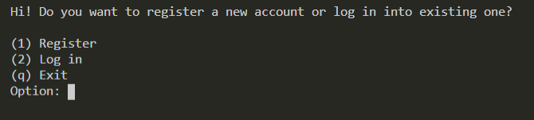

# Login System Console
Console version of login system application.  
Application created after some python courses just to test knowledge of basic python functionality.  

## Setup
1. Download repository  
2. Make sure you have python installed
2. Run app using terminal and command below
```
python LoginSystem.py
```
4. Enjoy 😊

##
Application registers users and let them log in and...that's it.  
Users are stored in .txt file in JSON.  

Example of user entity stored: 
``` json
{
    "name": "test",
    "password": "0d358d1154ccf45ad8206716558b0ebe9aa3ac1723aeed2ae861e15952fae36b", 
    "email": "email@email.com", 
    "salt": "AybtgOHm"
}
```

This small app was developed just for getting to know python, in real application **do not store salt** and I think **database** would be better than simple .txt file. 😉

## Screenshots

